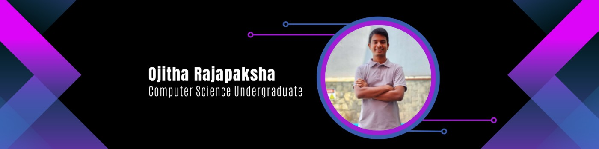

<div align="center">



# Hi there, I'm Ojitha Rajapaksha

### Computer Science Undergraduate • Software Engineer • Full-Stack Developer

<p>
  <strong>Building modern digital solutions with code, creativity & curiosity.</strong>
</p>

<br>

<a href="https://ojitharajapaksha.com">
  
</a>

<a href="mailto:ojitharajapaksha@gmail.com">
  
</a>

<a href="https://www.linkedin.com/in/ojitha-rajapaksha-10b126269/">
  
</a>

</div>

---

## About Me

I'm a **Computer Science undergraduate at the University of Westminster** with a strong interest in **software engineering, full-stack development, machine learning, cyber security, and digital product development**.

I enjoy turning ideas into practical software solutions and working across the entire development lifecycle — from **requirements and system design to development, deployment, and maintenance**.

I'm particularly interested in creating applications that are:

* Scalable
* Modern and user-friendly
* High-performing
* Secure
* Intelligent
* Practical and impactful

---

## What I'm Currently Working On

```text
Full-Stack Development
Machine Learning & AI
Explainable AI
Cyber Security
Software Architecture
Cloud & DevOps
Modern UI/UX
Continuous Learning
```

---

## Tech Stack

### Languages

<div align="center">


</div>

### Frontend

<div align="center">


</div>

### Backend

<div align="center">


</div>

### Databases

<div align="center">


</div>

### DevOps & Tools

<div align="center">


</div>

---

## Additional Technologies

<div align="center">


</div>

---

## Development Areas

| Area                     | Technologies                                         |
| :----------------------- | :--------------------------------------------------- |
| **Frontend Development** | React, Next.js, TypeScript, JavaScript, Tailwind CSS |
| **Backend Development**  | Node.js, Express.js, Spring Boot                     |
| **Database Development** | PostgreSQL, MySQL, MongoDB, Prisma                   |
| **API Development**      | REST APIs, Socket.IO                                 |
| **Machine Learning**     | Python, Machine Learning, Explainable AI             |
| **Cyber Security**       | Application Security, Secure Software Development    |
| **Cloud & Deployment**   | Vercel, Render, Firebase                             |
| **DevOps**               | Git, GitHub, Docker                                  |
| **UI/UX**                | Responsive Design, Modern Interfaces                 |
| **Software Engineering** | System Design, Architecture, Testing, Maintenance    |

---

## Development Philosophy

```text
Learn       → Understand the problem
Design      → Plan the solution
Build       → Turn ideas into software
Test        → Make it reliable
Deploy      → Take it to the real world
Improve     → Keep learning and evolving
```

---

## Currently Learning

* Advanced Machine Learning
* Explainable AI
* Multimodal AI
* Cyber Security
* Cloud Architecture
* Docker & Containerisation
* CI/CD
* Scalable System Architecture
* Application Security

---

## Professional Experience

### Software Engineering

My experience includes working on real-world software projects involving:

* Full-stack application development
* Backend API development
* Database design
* System maintenance
* Deployment and infrastructure
* Production support
* User training
* Digital platform development
* Software prototyping

---

## Connect With Me

<div align="center">

<a href="https://www.linkedin.com/in/ojitharajapaksha/">
  
</a>

<a href="https://www.instagram.com/ojitharajapaksha/">
  
</a>

<a href="https://www.facebook.com/profile.php?id=100075740273687">
  
</a>

<a href="https://www.youtube.com/@OjithaRajapaksha">
  
</a>

<a href="mailto:ojitharajapaksha@gmail.com">
  
</a>

</div>

---

<div align="center">

### Learn • Build • Improve • Repeat

<strong>Designed with passion, built with purpose, and driven by continuous learning.</strong>

</div>
